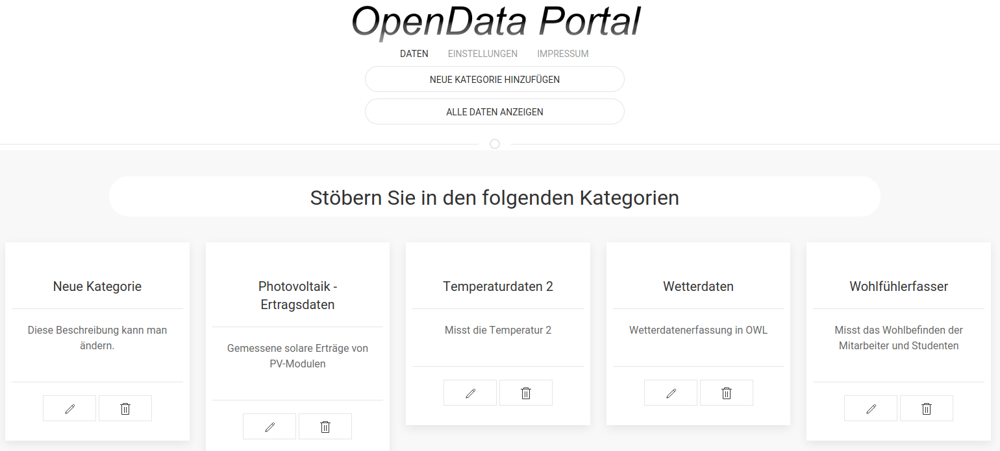
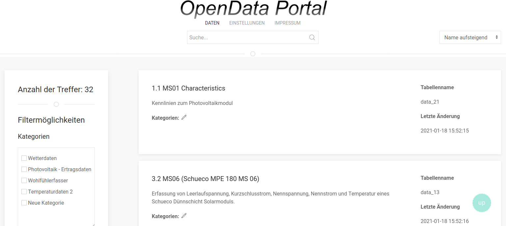
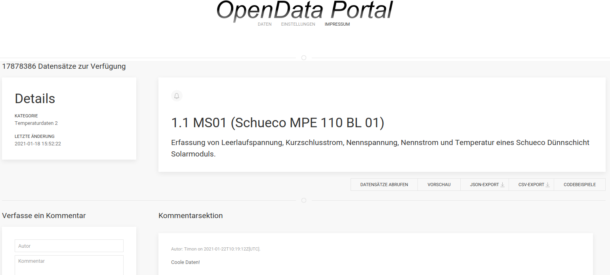

This is a webapplication (frontend). Its based on the last state of the SWAC GUI library.

Opendataportal is a webapplication to show data that was collected at the FH Bielefeld.
It was created in course of the module "Webengineering" at the FH Bielefeld.
As this only the frontend it is not operable on its own some screenshots show the
functionalities that were implemented.

Homepage

Overview of the available datasheets 

Detailed view of a datasheet

## Credits

This project was realized by Lukas von der Heide, Timon Buschendorf, Jekla Wilczek and Fabian List.